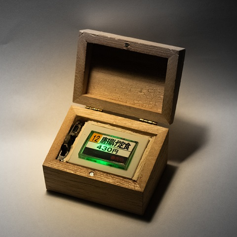
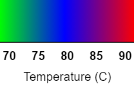

# SenchaTimer

Brewing a cup of Sencha (煎茶), the most popular type of tea in Japan, requires perfect timing in its execution. A small amount of leaves is brewed in the teapot for an exact amount of time in wate that usually is at 70 degrees. The same leaves can be infused more times, to make more cups, with different times and increasing temperature of water. This, clearly, called for a custom made timer that would be able to keep track of the infusions and measure the exact time for each.

For the type of Sencha I got I came to the following infusion times, depending on the quality you have it might vary:

| Infusion  | Time | Temperature (C)  |
|:---:|---:|:---:|
| 1 | 1:30  | 70 |
| 2 | 0:30  | 75 |
| 3 | 0:45  | 80 |
| 4 | 1:30  | 85 |
| 5 | 3:00  | 85 |

Below is a picture of the timer, which I chose to encase in a vending machine button toy replica. I should get around printing a label for it that actualyl reads Sencha, I know I know.

The timer can be operated as follows:

- On power up it will flash the number of the current infusions, the color of the flashes will indicate the infusion temperature whit the following colors:

- Press the button as soon as the water is poured
- The time will start to breath a yellow light that will gently fade towards green as the infusion progresses
- When the time is up the timer will flash green fast few times, pour the tea in the cup
- From here the timer will start to flash the next infusion number
- When ready for the next cup repeat the process above

You can:

- Power it off to preserve battery, when you power it on it will remember the previous infusion number
- Reset it to the first infusion if needed: long press the button when the timer is not running. Red/Green will flash in fast sequence, release the button. At this point the light will alternate between red and green every few seconds. Press the button when it's green to reset or when it's red to abort the reset procedure.
- Reset an infusion to its start: long press the button while an infusion is running. The light will flash green/yellow and the timer will be reset ready to start again the current infusion.
